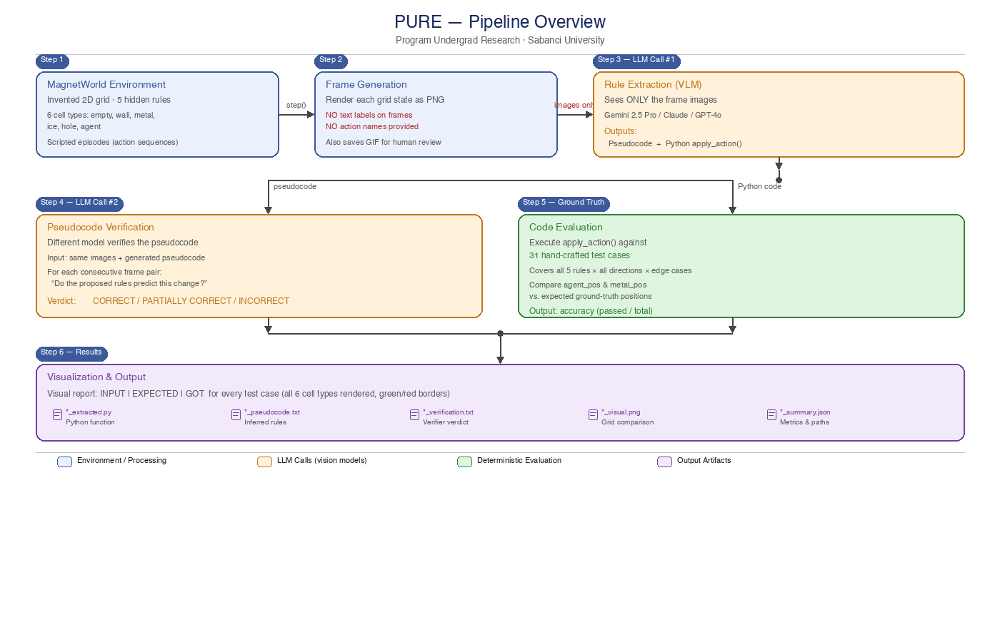
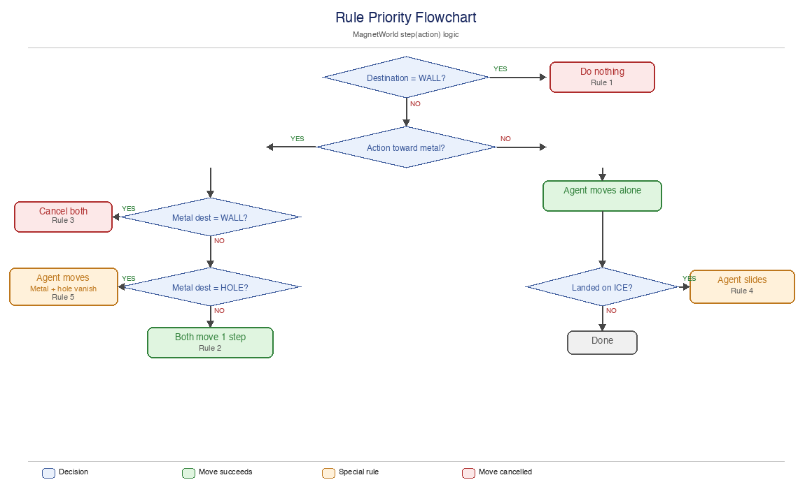

# Executable Environment Models from Visual Environment Data using LLMs

**Can a vision-language model watch a short video of an unknown environment and write correct code describing its rules — from pixels alone?**

This is a research project exploring **visual rule induction via program synthesis**. A VLM is shown a sequence of rendered frames from a completely invented 2D grid environment and must produce:

1. **Pseudocode** — a human-readable description of the inferred rules
2. **Python** — an executable transition function

The model receives **only images**. No cell legends, no action labels, no semantic hints. It must figure out every rule purely from observing what changes between frames.

A second LLM then **independently verifies** the pseudocode against the same images, checking whether the proposed rules correctly predict every observed transition.

Finally, the generated Python code is **evaluated against ground-truth test cases** that exercise every rule and edge case.

---

## Full Pipeline



**Step 1 — Environment:** MagnetWorld generates grid states via `step(action)` using scripted episodes.
**Step 2 — Frame Generation:** Each state is rendered as a clean PNG (no text labels, no action names).
**Step 3 — Rule Extraction (LLM #1):** The VLM sees *only* the images and must infer all rules, outputting pseudocode + Python.
**Step 4 — Verification (LLM #2):** A different model checks the pseudocode against the same images frame-by-frame.
**Step 5 — Code Evaluation:** The generated `apply_action()` is tested against 31 ground-truth test cases.
**Step 6 — Visualization:** Side-by-side grid comparison (INPUT | EXPECTED | GOT) for every test case.

### What the VLM sees vs. what it does NOT see

| Provided to VLM | NOT provided to VLM |
|---|---|
| Raw PNG frames (no labels) | Cell type names (wall, metal, ice, hole) |
| "Infer the rules from these images" | Action names (UP, DOWN, LEFT, RIGHT) |
| Required Python function signature | Integer-to-cell mapping |
| | "Toward" / "away" / "attraction" hints |
| | Any description of the rules |
| | Grid coordinates or positions |

The VLM must independently discover: what each visual element is, how the agent moves, what actions exist, how objects interact, and all edge cases.

---

## Why an invented environment?

Using a known environment like Sokoban would be scientifically meaningless: frontier VLMs have almost certainly seen its rules in training data. If the model produces correct code, you cannot tell whether it *read your images* or *remembered the rules*.

**MagnetWorld** is a completely made-up environment whose rules exist nowhere on the internet. The model cannot recall them — it can only learn them by observing your frames.

---

## MagnetWorld — The Environment

A 2D grid with six cell types:

| Visual | Integer | Meaning |
|---|---|---|
| Light cream background | `0` | Empty floor |
| Dark gray crosshatch | `1` | Wall |
| Blue diamond | `2` | Metal object |
| Cyan background + green triangle | `3` | Ice |
| Dark background + orange X | `4` | Hole |
| Red circle | `5` | Agent |

### Actions

The agent has 4 possible actions, each moving one cell in a cardinal direction:

| Action | Integer | Direction       |
|--------|---------|-----------------|
| UP     | `0`     | row - 1         |
| DOWN   | `1`     | row + 1         |
| LEFT   | `2`     | col - 1         |
| RIGHT  | `3`     | col + 1         |

Every step, the environment processes the action through the following rules **in priority order**. The first matching rule is applied; later rules are skipped.

### The Five Invented Rules

---

#### Rule 1 — Wall blocks agent

If the agent's destination cell is a **wall**, the entire action is ignored. Nothing moves. This is the very first check and overrides everything else.

```
Before:              After (agent moves RIGHT into wall):
. A | . .      →     . A | . .      ← nothing happened
```

---

#### Rule 2 — Magnetic attraction (toward detection)

**Definition of "toward":** An action is *toward* the metal if the movement direction has a positive component in the direction of the metal **along the action axis**. Concretely:

| Action | Toward condition                      |
|--------|---------------------------------------|
| DOWN   | metal row > agent row                 |
| UP     | metal row < agent row                 |
| RIGHT  | metal col > agent col                 |
| LEFT   | metal col < agent col                 |

Note: this check is **axis-only**. If the agent moves RIGHT and the metal is anywhere with a higher column (even on a completely different row), the move counts as "toward." The metal does not need to be in the same row or column.

**When the action is toward the metal**, both the agent and the metal shift one step in the action direction simultaneously. The metal moves in the **same direction** as the agent (not toward the agent — they co-move).

```
Before:              After (agent moves RIGHT, metal col > agent col):
. A . . M .    →     . . A . . M    ← both shifted right by one

Before:              After (agent moves DOWN, metal is below-right):
. . . . .            . . . . .
. A . . .      →     . . . . .      ← agent moved down
. . . . .            . A . . .
. . . M .            . . . . M      ← metal also moved down (same direction)
```

**When the action is NOT toward** (away from metal, orthogonal, or metal is gone), only the agent moves. The metal stays put.

```
Before:              After (agent moves RIGHT, metal is to the LEFT):
. M . A . .    →     . M . . A .    ← only agent moved; metal untouched
```

---

#### Rule 3 — Blocked attraction (wall cancels both)

When the action is "toward" the metal (Rule 2 applies), the metal's destination is checked **before** either object moves. If the metal's destination cell is a **wall**, the **entire move is cancelled** — neither the agent nor the metal moves. The agent does NOT move alone in this case.

```
Before:              After (agent moves RIGHT toward metal; metal would hit wall):
. A . M |      →     . A . M |      ← nothing moved at all
```

This means a metal object that is adjacent to a wall effectively "blocks" the agent from making any toward-move in that direction, even if the agent's own destination is empty.

---

#### Rule 4 — Ice slide

**Trigger:** The agent steps onto an **ice cell** AND the action is **not** a toward-attraction move (i.e., Rule 2 did not apply for this step).

**Behavior:** After the initial one-cell move onto the ice, the agent continues sliding in the **same direction**, one cell at a time. The slide continues as long as the next cell is also ice. The agent stops when:
- The next cell in the slide direction is a **wall** — agent stays on the last ice cell.
- The next cell in the slide direction is the **metal object** — agent stays on the last ice cell.
- The next cell is **not ice** (empty, hole, etc.) — agent moves onto that cell and stops.

The agent can slide across many ice cells in a single action. The metal is never affected by ice — only the agent slides.

**Ice does NOT trigger during attraction moves.** If the agent steps onto ice while executing a toward-move (Rule 2), no sliding occurs.

```
Before:              After (agent moves RIGHT onto ice, not toward metal):
. A ❄ ❄ ❄ . .  →    . . . . . A .  ← slid across 3 ice, stopped at empty

Before:              After (agent moves RIGHT onto ice, wall at end):
. A ❄ ❄ ❄ |    →    . . . . A |    ← slid to last ice cell before wall

Before:              After (agent moves RIGHT onto ice, metal blocking):
. A ❄ ❄ M . .  →    . . . A M . .  ← slid to last ice cell before metal
```

---

#### Rule 5 — Hole consumes metal

**Trigger:** The action is a toward-attraction move (Rule 2) AND the metal's destination cell is a **hole**.

**Behavior:** The agent moves one step as usual. The metal and the hole **both disappear** — both cells become empty floor. After this, the metal no longer exists on the grid (it is gone for the rest of the episode).

The agent itself is **not affected** by holes. The agent can freely walk over hole cells as if they were empty floor.

```
Before:              After (agent moves RIGHT toward metal; metal lands on hole):
. A . M O .    →     . . A . . .    ← agent moved; metal + hole both gone

Before:              After (agent moves RIGHT onto hole, not toward metal):
M . . A O .    →     M . . . A .    ← agent walks over hole; nothing consumed
```

---

### Rule Priority Summary



Ice and hole never interact directly. Ice only affects the agent during non-attraction moves. Holes only affect the metal during attraction moves.

---

## Experiment 01 — Single Rule Extraction (3 rules)

Tests the original 3 rules (movement, attraction, blocked attraction) on small grids.

### Pipeline

```
[1/5] Generate frames  →  [2/5] Extract rules (LLM #1)  →  [3/5] Verify pseudocode (LLM #2)
  PNG frames, no labels      Images only → pseudocode        Same images + pseudocode
  + GIF for inspection       + Python code                   → verdict + issues

                         →  [4/5] Evaluate code            →  [5/5] Visualize
                              apply_action() vs 21             INPUT | EXPECTED | GOT
                              ground-truth test cases          per test case as PNG
```

### Episodes

| Episode | Actions | Purpose |
|---|---|---|
| `attract_3steps` | DOWN x 3 | Shows attraction clearly — every step demonstrates the rule |
| `mixed_6steps` | RIGHT, RIGHT, UP, UP, LEFT, DOWN | Mixed directions — shows when metal moves and when it doesn't |
| `wall_block` | RIGHT x 2 | Metal against wall — tests blocked attraction |

### Test Suite (21 cases)

| Category | Count | Tests |
|---|---|---|
| Basic movement | 4 | `move_right_empty`, `move_down_empty`, `move_left_empty`, `move_up_empty_away` |
| Wall blocks | 4 | `wall_blocks_agent`, `wall_blocks_left`, `wall_blocks_up`, `wall_blocks_down` |
| Attraction | 6 | `toward_right/down/left/up_both_move`, `adjacent_toward_right/down` |
| Blocked attraction | 4 | `metal_hits_wall_right/down/left/up_cancel` |
| Away / orthogonal | 3 | `move_away_metal_stationary`, `orthogonal_metal_stationary`, `orthogonal_right_metal_below` |

### Run

```bash
python experiments/exp01_single_rule.py
```

---

## Experiment 02 — Complex Rule Extraction (5 rules)

Extends Experiment 01 with larger 10x10 grids, internal walls, and the two new cell types (ICE + HOLE). The test suite grows from 21 to 31 cases covering all 5 rules.

### Episodes

| Episode | Grid | Actions | Purpose |
|---|---|---|---|
| `ice_demo` | 10x10 | RIGHT, UP, LEFT | Agent slides across ice strip |
| `hole_demo` | 10x10 | RIGHT x 4 | Agent attracts metal rightward into a hole |
| `attract_and_block` | 10x10 | RIGHT, LEFT, UP, DOWN | Blocked attraction + normal movement |
| `full_complex` | 10x10 | RIGHT, DOWN x 3, LEFT, UP x 2 | Ice slide, normal moves, attraction |

### Additional Test Cases (10 new, 31 total)

| Category | Count | Tests |
|---|---|---|
| Ice slide | 4 | `ice_slide_right`, `ice_slide_into_wall`, `ice_slide_left`, `ice_slide_down` |
| Ice edge case | 1 | `no_ice_normal_move` |
| Hole consume | 1 | `metal_pushed_into_hole` |
| Hole edge cases | 2 | `metal_pushed_not_into_hole`, `agent_walks_over_hole` |
| Large grid | 2 | `large_grid_attract_through_corridor`, `large_grid_ice_slide` |

### Run

```bash
python experiments/exp02_complex_rule.py
```

---

## Experiment 03 — EchoWorld (a completely different game)

A second invented environment with rules that deliberately contradict MagnetWorld, to test whether the VLM is actually inferring rules from pixels rather than reusing memorised patterns from Experiment 01/02.

### EchoWorld cell types

| Visual | Integer | Meaning |
|---|---|---|
| Light lavender background | `0` | Empty floor |
| Dark crosshatch | `1` | Wall |
| Green diamond | `2` | Echo object |
| Dark purple X | `3` | Void |
| Yellow 4-point star | `4` | Beacon |
| Red circle | `5` | Agent |

### The Five EchoWorld Rules

1. **Wall blocks agent** — same as MagnetWorld: walking into a wall is a no-op.
2. **Echo moves opposite** — every step, the echo moves one cell in the *opposite* direction of the agent's action (UP↔DOWN, LEFT↔RIGHT). This is the inverse of MagnetWorld's attraction rule.
3. **Blocked echo does NOT cancel the agent** — if the echo's destination is a wall or the agent's new cell, the echo simply stays put while the agent still moves. (Contrast: in MagnetWorld a blocked metal cancels the whole move.)
4. **Void consumes echo** — if the echo would move onto a void cell, both the echo and the void disappear; the agent moves normally.
5. **Beacon bounces agent** — if the agent steps onto a beacon, it is bounced one extra cell in the same direction (unless that next cell is a wall or the echo).

### Episodes

| Episode | Grid | Actions | Purpose |
|---|---|---|---|
| `echo_basics` | 10x10 | RIGHT, RIGHT, DOWN, LEFT, UP | Echo moving opposite in open space |
| `echo_blocked` | 10x10 | RIGHT x 3 | Echo pushed into wall — stays, agent keeps moving |
| `void_demo` | 10x10 | RIGHT, RIGHT | Echo pushed into void — both vanish |
| `beacon_demo` | 10x10 | RIGHT, RIGHT | Agent hits beacon and bounces an extra cell |
| `full_echo` | 10x10 | RIGHT, DOWN, LEFT x 3 | Beacon + opposite echo across multiple directions |

### Run

```bash
python experiments/exp03_echo_world.py
```

The pipeline (frame generation → extraction → verification → evaluation → summary) is identical to Experiments 01/02; only the environment, episodes, and ground-truth test suite (`eval/echo_evaluator.py`) change.

---

## What the test suites actually measure

The test suites are the heart of the project — they are how we score whether the VLM's generated code *actually understood the rules* rather than just producing plausible-looking pseudocode.

Each test case is a `(grid, agent_position, action) → (expected_grid, expected_agent_position)` tuple. The grid is a small hand-built scenario that isolates **one specific behaviour** of one rule. We then:

1. Take the Python `apply_action(...)` function the VLM generated.
2. `exec` it inside a sandbox.
3. Run it on the test grid with the test action.
4. Compare the resulting grid (and agent/object positions) to the ground truth, cell by cell.

A test passes only if **every cell** matches. There is no partial credit per case.

The suites are designed so each rule is exercised by multiple cases at multiple difficulties:

| Suite | Total cases | Categories covered |
|---|---|---|
| MagnetWorld (exp01) | 21 | basic movement, wall blocks (4 directions), attraction (toward + adjacent), blocked attraction (4 directions), away/orthogonal non-attraction |
| MagnetWorld (exp02) | 31 | all of exp01 + ice slide (4 directions, into wall, no-ice case), hole consumption, hole edge cases, large-grid attraction through corridors |
| EchoWorld (exp03) | 22 | normal movement, opposite echo motion (4 directions), blocked echo (agent still moves), void consumption, beacon bounce, beacon blocked by wall/echo |

Critically, the test suites contain **edge cases the model never saw in the training frames**. The model sees one short episode of 5–8 frames, but is graded on dozens of grids it has never been shown. So the score reflects how well the inferred rules **generalise** beyond the specific situations used to teach them.

The accuracy reported in each run's `*_summary.json` is simply `n_passed / n_total` over the relevant suite.

---

## Overall results so far

These are the scores we've recorded from runs on `gemini-2.5-pro` (extractor) + `gemini-2.5-flash` (verifier) via fal.ai:

| Experiment | Environment | Tests | Best run | Mean | Verifier verdict pattern |
|---|---|---|---|---|---|
| exp02 | MagnetWorld (5 rules) | 31 | 11/31 (35%) | ~27% over 4 runs | 3/4 CORRECT — overly lenient |
| exp03 | EchoWorld (5 rules)   | 22 | 8/22 (36%)  | (1 run so far)    | INCORRECT |

What this tells us:

- **The model can extract *some* rules from pixels alone** — basic movement and wall blocking are essentially solved across runs. These cases pass reliably.
- **It struggles with higher-order interactions** — combined effects (attraction + wall, ice + edge of grid, beacon + echo) are where most failures concentrate.
- **There is high run-to-run variance** even with the same model on the same frames (16% – 35% on MagnetWorld), which suggests the inference is brittle and prompt-sensitive rather than robust.
- **EchoWorld's failure mode is particularly informative.** Inspecting the generated pseudocode shows the model imported MagnetWorld-style "same direction" attraction (the *opposite* of EchoWorld's actual rule), and even hallucinated a non-existent `WAIT` action with a fake patrol behaviour. This is direct evidence that part of the model's output comes from prior pattern-matching, not from observing the new frames — exactly the failure mode EchoWorld was designed to expose.
- **The verifier LLM is currently too lenient.** It marked 3 of 4 MagnetWorld runs as `CORRECT` despite all of them scoring below 36%. A stronger or more adversarial verifier is needed before its verdicts can be trusted as a quality signal.

These numbers should be read as a **baseline**, not a final result. The pipeline is now in place; the natural next steps are increasing the number of episodes shown to the extractor, closing the verifier→extractor feedback loop, comparing across stronger models, and finally building a planner on top of the extracted environment.

### Ablation — does showing the model more frames help?

The hypothesis was simple: the VLM is failing because it only sees 5–8 frames per episode. If we extend each primary episode to ~5x the frames (still a single episode, still one continuous trajectory, just longer and demonstrating more situations) the model should have an easier time inducting the rules. Each extended episode was hand-designed so that *every* rule is demonstrated multiple times across the trajectory, with no repeated no-ops.

| Experiment | Frames (old → new) | Old accuracy | New accuracy |
|---|---|---|---|
| exp01 (3 rules)  | 4 → 14  | (no prior baseline)         | 12/21 (57%), 10/21 (48%) |
| exp02 (5 rules)  | 8 → 35  | mean ~27% over 4 runs       | 9/31 (29%) |
| exp03 (5 rules)  | 6 → 31  | 8/22 (36%) (1 run)          | 7/22 (32%) |

**The extension did not improve accuracy.** exp02 stayed inside the existing variance band, exp03 was actually slightly worse, and exp01 (no prior baseline) sits in the same ~50% range we've seen across all MagnetWorld runs.

More interestingly, the failure modes changed in informative ways:

- **exp02 — overfitting to the new episode.** In the new sequence, the agent consumes the metal+hole during the very first two RIGHT actions (this was deliberate, to demo Rule 5 early). The extracted pseudocode now contains the rule *"if the agent's move is horizontal, remove ALL blue diamonds and orange X-boxes from the entire grid"*. The model latched onto a temporal coincidence between "horizontal move" and "metal disappears" — a hallucination directly caused by the longer episode giving it a richer surface to overfit to.
- **exp01 — invented mode systems.** One run produced a fictional "MIRROR / ROTATE" mode toggle on the metal object that has no basis in any frame. The other run dropped attraction entirely and modelled the metal as a static obstacle. Both are confidently confabulated rather than gaps in observation.
- **exp03 — same root cause as before.** The new pseudocode now correctly identifies void consumption (the longer episode helped reveal this rule, which was missed in the 6-frame version), but still claims the green diamond moves in the **same** direction as the agent — the inverse of the actual EchoWorld rule. The model is importing MagnetWorld's attraction prior even with 5x more disconfirming evidence.

**Takeaway:** more demonstration frames alone are not the bottleneck. The model is not failing because it lacks examples — it is failing because, given any plausible-looking sequence of frames, it produces a confidently wrong pseudocode that pattern-matches to grid-game priors from training data. Future improvements should focus on the *reasoning loop* (verifier→extractor feedback, multi-model voting, stronger prompts that force the model to explain each frame transition) rather than on simply giving the model more pixels.

---

## Verification Step — How it works

The verification is a separate LLM call (Step 4 in the pipeline diagram) designed to catch errors in the pseudocode before we even run the Python code. The verifier receives the **same images** plus the **generated pseudocode**, and checks every consecutive frame pair:

1. **What changed** visually between the two frames?
2. **Do the proposed rules** correctly predict this change?
3. **If not**, what specifically is wrong?

The verifier outputs a **verdict** (CORRECT / PARTIALLY CORRECT / INCORRECT) and a list of specific issues.

**Why a different model?** Using a different model (e.g., Gemini Flash to verify Gemini Pro's output) avoids the problem of a model being blind to its own mistakes. The verifier sees the same images independently and checks whether the rules actually match the observations.

---

## Output Files

Each experiment run produces the following in `results/`:

| File | Contents |
|---|---|
| `*_extracted.py` | Python `apply_action()` function generated by the VLM |
| `*_pseudocode.txt` | Human-readable rules inferred by the VLM |
| `*_verification.txt` | Frame-by-frame analysis, verdict, and issues from verifier LLM |
| `*_visual.png` | Side-by-side grid comparison (INPUT / EXPECTED / GOT) for every test case |
| `*_summary.json` | Accuracy, models used, verification verdict, paths to all output files |

---

## File Structure

```
.
│
├── experiments/
│   ├── exp01_single_rule.py      # 3-rule experiment (21 tests, small grids)
│   ├── exp02_complex_rule.py     # 5-rule experiment (31 tests, 10x10 grids)
│   └── exp03_echo_world.py       # EchoWorld — 5 rules in a different invented game
│
├── echo_env/
│   ├── __init__.py
│   └── echo_world.py             # EchoWorld: opposite-moving echo, void, beacon
│
├── magnet_env/
│   ├── __init__.py
│   └── magnet_world.py           # MagnetWorld: grid state, step(), PIL renderer
│                                  #   Constants: EMPTY(0), WALL(1), METAL(2),
│                                  #              ICE(3), HOLE(4), AGENT(5)
│
├── vlm/
│   ├── __init__.py
│   └── extractor.py              # LLM integration:
│                                  #   extract_rule()       — images → pseudocode + Python
│                                  #   verify_pseudocode()  — images + pseudocode → verdict
│                                  #   save_frames_as_images(), record_episode_gif()
│                                  #   Providers: fal (OpenRouter), Claude, GPT-4o
│
├── eval/
│   ├── __init__.py
│   ├── evaluator.py              # Ground-truth test suites:
│   │                              #   build_test_cases()         — 21 tests (Rules 1-3)
│   │                              #   build_complex_test_cases() — 31 tests (Rules 1-5)
│   │                              #   evaluate_extracted_function()
│   ├── visualizer.py             # PIL-based visual report: INPUT | EXPECTED | GOT
│   │                              #   Renders all 6 cell types (including ICE + HOLE)
│   ├── pipeline_diagram.py       # Generates results/pipeline_diagram.png
│   └── rule_diagram.py           # Generates results/rule_priority_diagram.png
│
├── frames/                       # Auto-generated PNG frames per episode (no labels)
├── gifs/                         # Auto-generated GIF animations per episode
├── results/                      # All output: code, pseudocode, verification, visuals, summary
│
└── README.md
```

---

## Setup

```bash
pip install openai anthropic pillow python-dotenv
```

Set your API key in the environment or a `.env` file:

```
FAL_KEY=your_fal_api_key   # get at https://fal.ai/dashboard
```

### Run

```bash
# Experiment 01 — small grids, 3 rules, 21 tests
python experiments/exp01_single_rule.py

# Experiment 02 — large grids, 5 rules, 31 tests
python experiments/exp02_complex_rule.py
```

> **PyCharm:** Run > Edit Configurations → Script path: `experiments/exp01_single_rule.py`, Working directory: project root.

---

## Configuration

In each experiment file:

```python
PRIMARY_EPISODE = "full_complex"         # episode to send to VLM
PROVIDER        = "fal"                  # fal | claude | gpt4o
MODEL           = "google/gemini-2.5-pro"  # extraction model
VERIFY_MODEL    = "google/gemini-2.5-flash"  # verification model
```

Available models via fal.ai OpenRouter:

| Model | Notes |
|---|---|
| `google/gemini-2.5-flash` | Fast, cheap — good for verification |
| `google/gemini-2.5-pro` | Stronger reasoning — good for extraction |
| `anthropic/claude-sonnet-4-6` | Claude via OpenRouter |
| `openai/gpt-4o` | GPT-4o via OpenRouter |

Direct APIs: set `PROVIDER = "claude"` (needs `ANTHROPIC_API_KEY`) or `"gpt4o"` (needs `OPENAI_API_KEY`).

---

## The Bigger Picture

This project is a proof of concept for a broader research question: **can VLMs act as program synthesizers from visual experience?**

If a model can reliably extract transition rules from a handful of frames in an environment it has never seen — with no text hints, no labels, no prior knowledge — this opens a path toward agents that learn to model unknown environments purely by watching.

No hand-coded reward functions. No environment descriptions. No labeled datasets. Just pixels → rules → code.
